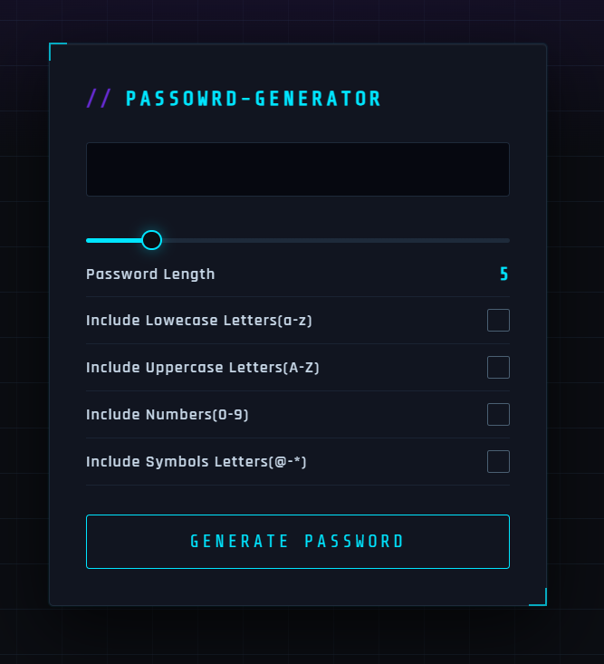

# 🔐 Random Password Generator

A simple and interactive password generator built using **HTML, CSS, and JavaScript**.
It allows users to generate secure passwords with customizable options like length, uppercase, lowercase, numbers, and symbols.

---

## 🚀 Features

* Adjustable password length using slider
* Include/exclude:

  * Lowercase letters
  * Uppercase letters
  * Numbers
  * Symbols
* One-click password generation
* Copy to clipboard functionality 📋
* Clean and modern UI

---

## 🛠️ Tech Stack

* HTML
* CSS
* JavaScript

---

## 🎨 Frontend Note

The frontend UI design was created with the help of **Claude AI**.

---

## 📁 Project Structure

```
random-password-generator/
│
├── index.html
├── style.css
├── script.js
├── readme.md
└── screenshot/
    └── image.png
```

---

## 📸 Screenshot



---

## ⚡ How to Use

1. Open `index.html` in your browser
2. Adjust password length using the slider
3. Select the character types
4. Click **Generate Password**
5. Click 📋 to copy the password

---

## 💡 Future Improvements

* Password strength indicator
* Auto-copy on generation
* Better randomness (crypto-based)
* UI animations

---

## 📌 Author
@suchitrakumar1

